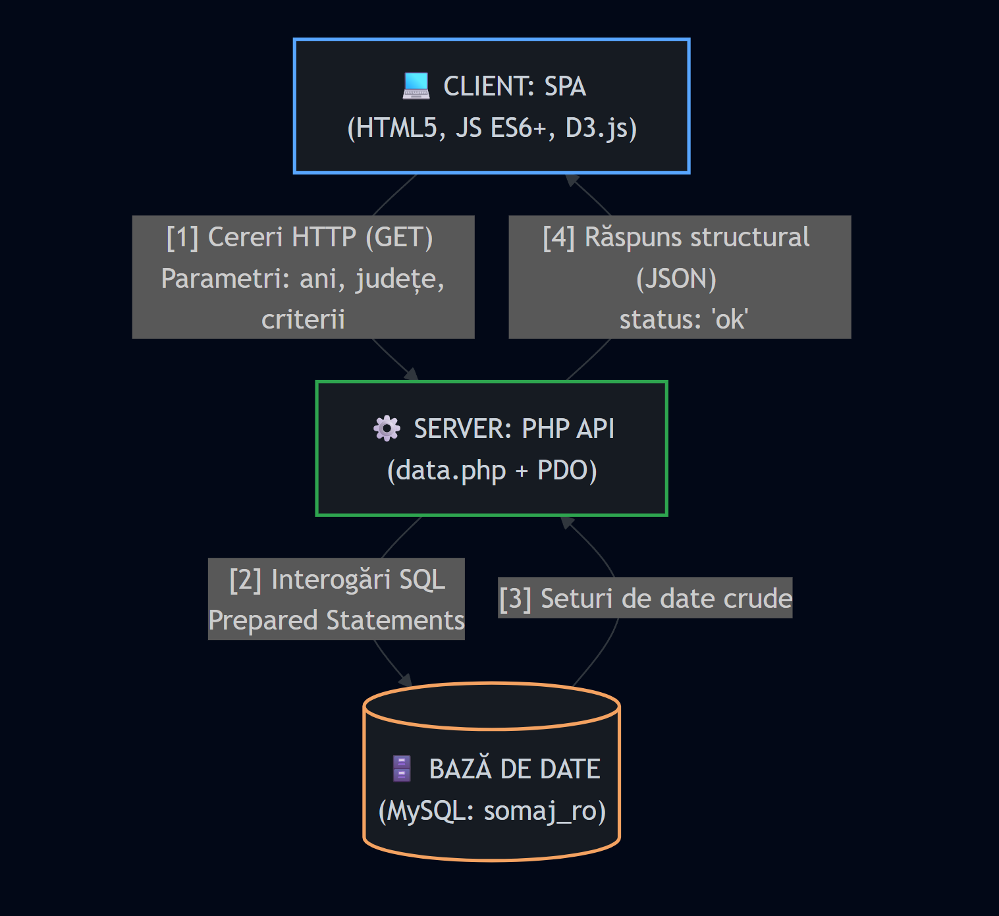

# ȘomajRO – Analiză Multi-Criterială a Șomajului din România

## 1. Introducere (Introduction)

### 1.1 Scopul Documentului (Purpose)
Acest document definește specificațiile funcționale și tehnice complete pentru platforma web interactive de analiză statistică **ȘomajRO**. Obiectivul principal este descrierea cerințelor esențiale, a fluxurilor de date și a interacțiunii utilizatorului cu modulele vizuale bazate pe datele INS și ANOFM.

### 1.2 Domeniul de Aplicare (Scope)
Sistemul funcționează ca un Tablou de Bord (Dashboard) analitic de tip Single Page Application (SPA). Aplicația permite filtrarea dinamică, vizualizarea multi-criterială (grafice bare, linii, radar), reprezentarea cartografică (coropleth) și exportul rapoartelor în formate multiple (CSV, SVG, PDF).

## 2. Descrierea Generală (Overall Description)

### 2.1 Perspectiva Produsului (Product Perspective)
ȘomajRO utilizează o arhitectură decuplată (Client-Server):
* **Frontend**: HTML5, CSS și JavaScript.
* **Backend**: Script PHP pentru interogări parametrizate și conexiune securizată MySQL.

* [Utilizator] <---> [Interfață HTML5/JS] <---> [data.php] <---> [Baza de date MySQL]

  

  ### 2.2 Funcționalitățile Produsului (Product Functions)
1.  Filtrarea avansată a seturilor de date pe criterii multiple (ani, rezidență, sex, vârstă, educație, localizare geografică).
2.  Generarea instantanee de statistici agregate (valori medii, extreme teritoriale).
3.  Reprezentare grafică polimorfică (serii de timp, structuri pe categorii).
4.  Generare de hărți dinamice cu suport GeoJSON.
5.  Motor de export local pentru persistența analizelor în formate destinate utilizării office (CSV) sau prezentărilor (SVG, PDF).

### 2.3 Caracteristicile Utilizatorului (User Characteristics)
Utilizatorul țintă include analiști de date, studenți în științe sociale, jurnaliști sau decidenți politici. Nu sunt necesare cunoștințe tehnice avansate de interogare a bazelor de date.

### 2.4 Restricții (Constraints)
* Aplicația trebuie să funcționeze pe browsere moderne fără plugin-uri suplimentare.
* Interfața trebuie să rămână complet operațională (prin date statice pre-compilate ca fallback) în cazul în care serverul de baze de date devine indisponibil.

## 3. Cerințe Specifice (Specific Requirements)

### 3.1 Cerințe Funcționale (Functional Requirements)

#### 1: Modulul de Management al Filtrelor
* **Descriere**: Sistemul trebuie să colecteze interactiv starea inputurilor (glisoare temporale și casete de selectare).
* **Interacțiune**: Modificarea glisorului de început (`An început`) va ajusta automat valoarea minimă a glisorului de sfârșit (`An sfârșit`) pentru a preveni anomaliile cronologice.
* **Backend**: Datele colectate sunt trimise sub formă de query string parametrizat (`?action=stats&yr_start=...&yr_end=...`) către API-ul PHP.

#### 2: Statistici Agregate Rapide
* **Descriere**: Afișarea automată în timp real a indicatorilor cheie: rată medie, volum estimat de șomeri și extremele județene (minim/maxim) bazate pe intervalul selectat.

#### 3: Vizualizare Grafică Multi-Criterială
* **Descriere**: Generarea automată a 4 tipuri de vizualizări prin tab-uri:
    * *Bare*: Distribuția comparativă a tuturor județelor cu cod de culori semantic (Verde: Șomaj scăzut, Portocaliu: Mediu, Roșu: Ridicat).
    * *Linii*: Evoluția temporală longitudinală (limitată la maximum 10 județe concurente pentru lizibilitate) și distribuția pe grupe de vârstă, educatie, mediu si sex.
    * *Radar*: Profil pânză de păianjen pe bază de indicatori normalizați (0-10) pentru analiza detaliată a structuralității șomajului.
    * *Harta*: Harta Romaniei impartita pe judete astfel incat sa se poate afisa statisticele separate pentru fiecare judet in functie de criteriul selectat

#### 4: Motor Cartografic Dinamic (Coropleth)
* **Descriere**: Randarea hărții României pe baza unui fișier GeoJSON preluat prin flux asincron.

#### 5: Subsistemul de Export
* **Descriere**: Extracția datelor procesate direct din memoria clientului fără re-interogarea serverului.
* **Formate suportate**:
    * `CSV`: Format text cu prefixarea octeților `\uFEFF` pentru forțarea codajului UTF-8 în aplicații utilitare (ex: Microsoft Excel).
    * `SVG`: Export XML curat al elementelor vectoriale DOM.
    * `PDF`: Generare de documente landscape A4 utilizând motorul JS local, incluzând generarea automată a paginilor noi pentru tabele extinse (auto-pagination).

### 3.2 Cerințe de Interfață și Interacțiune (User Interface Requirements)

#### 1: Design și Ergonomie (Look and Feel)
* Interfața adoptă un stil industrial-tehnic axat pe o temă întunecată (Dark Mode), optimizând contrastul textului lizibil în raport cu graficele iluminate.

#### 2: Tooltip-uri Contextuale Interactive
* La trecerea cursorului (hover) peste elementele hărții sau elementele grafice din canvas, aplicația va ancora dinamic un element tooltip global ascuns în restul timpului. Acesta va urmări coordonatele `clientX` și `clientY` ale utilizatorului, afișând date explicative structurate.

#### 3: Tabel Sortabil
* Interfața de tip tabel permite ordonarea datelor prin interacțiune directă (click) pe capul de tabel (`<th>`). Algoritmul implementează sortare bidirecțională (crescător/descrescător).

---

### 3.3 Cerințe de Performanță și Siguranță (Non-Functional Requirements)

#### 1: Disponibilitate și Toleranță la Erori (Fault Tolerance)
* Aplicația va verifica starea conexiunii prin tehnica *Ping-Pong* la inițializare.
* În caz de eșec al bazei de date (status `error`), widgetul `#db-badge` își va schimba clasa CSS în mod vizibil.
